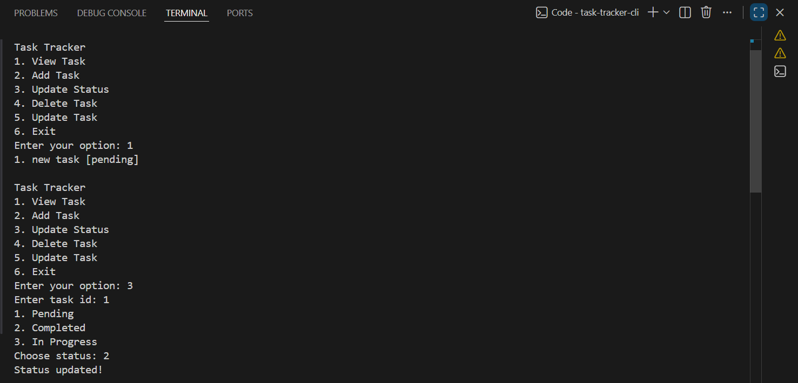

**Project URL:** - https://roadmap.sh/projects/task-tracker

## CLI Task Tracker
About the Project

1. This is a simple Command Line Task Tracker made using Python.
2. You can add tasks, update tasks, change status, and delete tasks.
3. All tasks are stored in a JSON file, so your data is saved even after closing the program.

**This project helped me learn:**

1. Python basics
2. File handling
3. JSON
4. Lists and dictionaries
5. Functions

## Features

The application can:

1. View tasks
2. Add a task
3. Update task title
4. Change task status (pending / in-progress / completed)
5. Delete task
6. Save tasks in JSON file

## How to Run the Project
1. Install Python
2. Open terminal
3. Go to project folder
4. Run: python main.py

